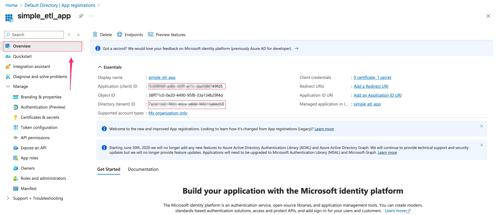

## 1. Architecture Overview  

This project demonstrates a simple ETL pipeline built with Azure services. The raw data consists of log files capturing customer activity from streaming services, which are uploaded to Azure Data Lake Storage Gen2 (ADLS2). These files form the basis for further processing.

The data is then ingested, processed, and transformed in Azure Databricks using the Medallion Architecture:

  - **Bronze Layer**: Stores the raw logs as ingested, preserving the original format.

  - **Silver Layer**: Cleans and standardizes the data, applying schema enforcement, handling nulls, and enriching with additional attributes.

  - **Gold Layer**: Produces curated, business-ready datasets that capture key insights about customer usage patterns, trends, and performance metrics.

Finally, the transformed results in the Gold layer are made available for visualization and analysis in Power BI, enabling interactive dashboards and data-driven decision-making around customer behavior and service usage.

## 2. Setup  

### 2.1 Resource Group:  
- In the Azure Portal, search for **Resource groups** and click **Create**.  
- Make sure to choose the region closest to you.  

  

### 2.2 Storage Account:  
- In the Azure Portal, search for **Storage accounts** and click **Create**.  

  
  

- Keep the default settings for the remaining steps and click **Create**.  

  

- After the storage account is created, create a container named **data** and inside it create four directories: **raw**, **bronze**, **silver**, and **gold**.  

  
  

- Upload the log content files to the **raw** folder:  

  

### 2.3 Register an App  
- In the Azure Portal, search for **Microsoft Entra ID** and register a new application.  

  
  

- Create a **client secret**:  

  

- Copy the secret value and store it somewhere safe, as you won’t be able to view it again.  

  

- You will also need the **Application (client) ID** and **Directory (tenant) ID**.  

  

### 2.4 Grant Access Control:  
- Go back to the storage account, open **Access Control (IAM)**, and add a role assignment.  

  
  
  

- Review and assign the role.  

### 2.5 Setup Azure Databricks Workspace: (Community version can also be used)  
- In the Azure Portal, search for **Azure Databricks** and create a new workspace.  

  
  

## 3. Run Pipeline:  
- In the Databricks workspace, create a compute cluster of your choice. Remember to set **Terminate after minutes of inactivity**.  

  

- In the workspace, create a new folder and upload the notebook files:  

  

- In the `01.setup` notebook, fill in all the credentials generated in **Step 2**.  

  

- Run the `05.full_run` notebook to execute the entire data pipeline end-to-end. This pipeline includes the following stages:  
  - **Bronze Layer**: Ingests raw data files and performs basic cleaning such as removing nulls, standardizing formats, and applying schema enforcement. The output is a raw but readable Delta table for further processing.  
  - **Silver Layer**: Applies refined transformations including data cleansing, enrichment, creation of calculated columns, and aggregations. Produces clean, structured datasets suitable for downstream use.  
  - **Gold Layer**: Applies final business-level transformations to generate curated datasets optimized for analytics, reporting, or machine learning. This layer contains denormalized, analysis-ready tables for business users and dashboards.  

- After running the pipeline, the result files will be generated in the **bronze**, **silver**, and **gold** folders.  
